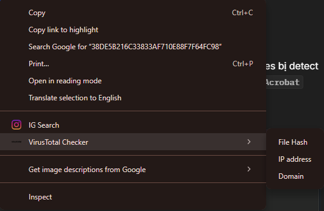

### VIRUS TOTAL CHECKER 👌
- Tool được dùng để check hash, url, domain, ip nhanh vì lười mở vt ra và copy paste :D 

### Usage 
- Bôi đen `hash`, `url`, `domain`, `ip` cần check rồi right click chọn `Virus Total Checker`. Tool sẽ mở tab mới với kết quả search của VT với query là kí tự được bôi đen. 

### Installation 

#### Chrome
- Clone repo này về máy 
- Mở `chrome://extensions/`
- Bật `Developer mode`
- Chọn `Load unpacked`
- Chọn folder chứa repo vừa clone về 
- Done 

#### Firefox
- Clone repo này về máy
- Mở `about:debugging#/runtime/this-firefox`
- Chọn `Load Temporary Add-on`
- Chọn file `manifest.json` trong folder chứa repo vừa clone về
- Done

### Note 
- Chạy được trên Chrome và Firefox. 
### Credits
Kiendt19 